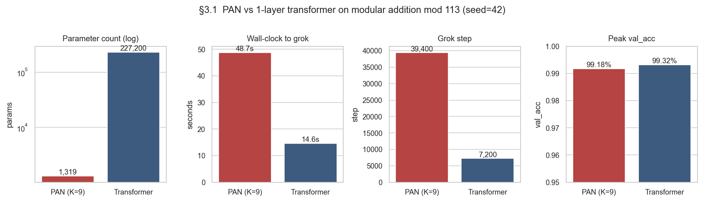
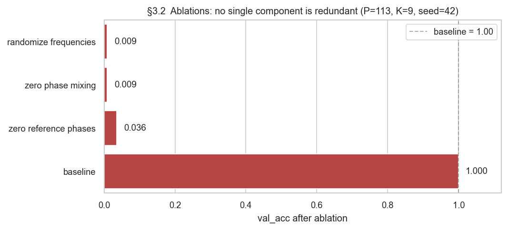
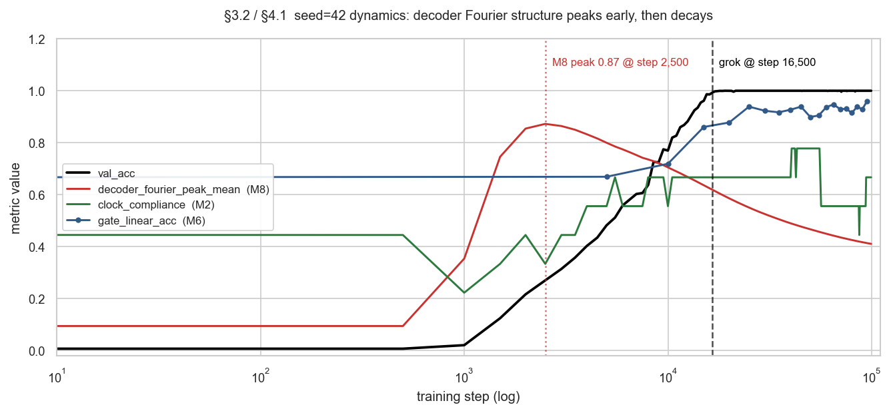
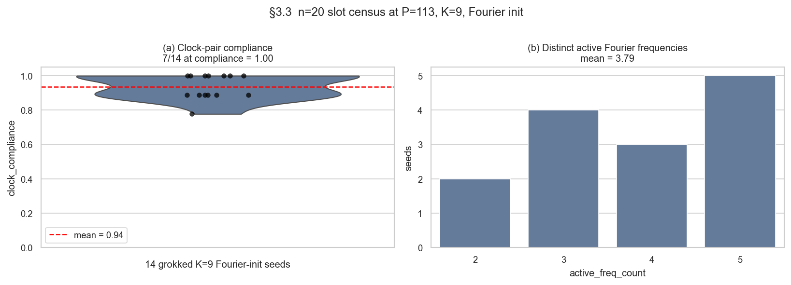
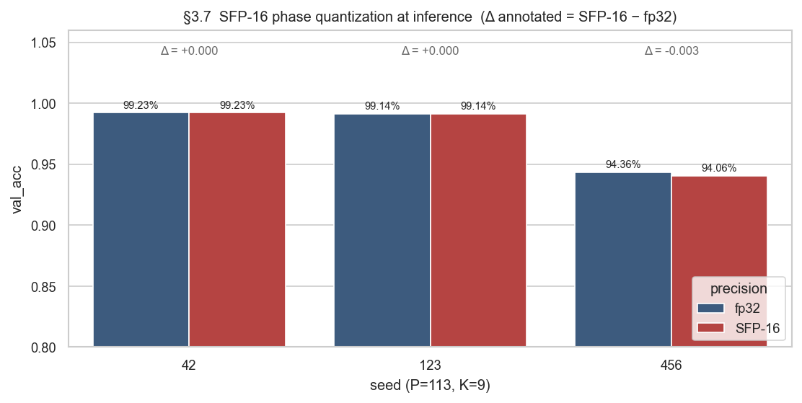
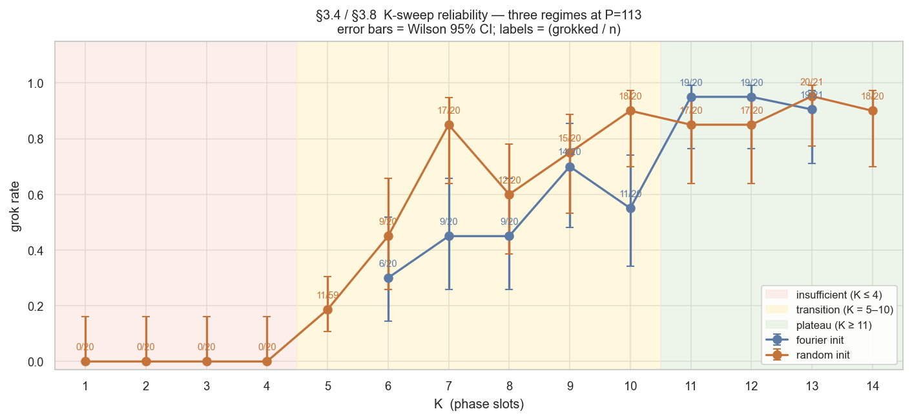

# Phase Accumulator Networks: Phase Arithmetic as a Neural Primitive for Modular Computation

**Jacob Hollenbeck — April 2026**
*Companion code: `pan_lab/` · Companion documents: Spectral IEEE 754 Whitepaper, SPF Format Specifications*

---

## Abstract

Mechanistic interpretability research on transformers trained on modular
arithmetic has shown that these networks, despite their general-purpose
multiply-accumulate architecture, converge on circuits built from sparse
Fourier representations — inputs are encoded sinusoidally, combined via
trigonometric identities, and decoded through sinusoidal projection
(Nanda et al. 2023; Zhou et al. 2024; Kantamneni & Tegmark 2025). We
ask whether the same computation can be the architecture itself rather
than something gradient descent must discover.

We introduce **Phase Accumulator Networks (PAN)**: a neural architecture
whose primitive operation is sinusoidal phase addition on the unit
circle. On modular addition mod P for P ∈ {43, 59, 67, 71, 89, 97, 113,
127}, PAN at K=10 with random encoder-frequency initialization grokks
**24 of 24 seeds (3 per prime)** to val_acc ≥ 0.99 with 703–1,627
parameters — **140–323× fewer** than a one-layer transformer baseline
(227,200 parameters at P=113, d_model=128). Across 20 independent
seeds at P=113 and a sweep over the number of phase slots K, the
architecture exhibits three distinct reliability regimes: an
**insufficient regime** (K ≤ 4) where no seed grokks, an
**init-sensitive transition regime** (K=5..10) where Fourier and random
encoder initializations produce sharply different reliability — random
initialization wins by up to 40 percentage points at K=7 and 35 at K=10
— and a **plateau** (K ≥ 11) where both initializations grok ≥ 85% of
seeds and the choice is roughly indifferent; an n=21 K=13 sweep firms
up the plateau at **90.5% (Fourier) and 95.2% (random)**. In every
grokked run the phase-mixing matrix exhibits Clock-pair structure: at
K=9 the mean fraction of mixing-matrix rows forming a Clock pair is
0.94 across 14 grokked seeds. 16-bit phase quantization at inference
preserves accuracy to within 0.3% on the 3 seeds tested at K=9, and to
zero measurable loss at the seeds we examined in detail.

We are careful with one claim. While our mixing-matrix inspection
establishes Clock-pair structure, full mechanistic equivalence to the
transformer's Clock algorithm requires characterizing the
gate-plus-decoder stack. A direct test — replacing the trained decoder
with a theoretical Fourier decoder constructed from the learned encoder
frequencies — collapses validation accuracy from ~0.99 to ~0.01 in 3 of
3 seeds. PAN's decoder is doing more than projecting onto class-indexed
sinusoids. The gate-plus-decoder mechanism remains an open question.

---

## 1. Introduction

Two recent bodies of work motivate this paper.

First, **mechanistic interpretability of grokking**. Nanda et al. (2023)
showed that a 1-layer transformer trained on modular addition mod 113
converges on a specific Fourier-based circuit: input embeddings settle
on a sparse set of frequencies {14, 34, 41, 42, 52}; the MLP computes
cos(A)cos(B) − sin(A)sin(B) = cos(A+B) via bilinear mixing; the
unembedding projects cos(f(a+b)) for the answer class. Subsequent work
(Zhou et al. 2024) found analogous structures in Pythia and GPT-J;
Kantamneni & Tegmark (2025) extended the finding to Llama-3.1-8B.
These results are consistent: grokking on modular arithmetic converges
on Fourier circuitry, regardless of scale or architecture family.

Second, the **Spectral IEEE 754 (SPF) format**, a log-polar number
representation where a scalar is encoded as (sign, log-magnitude,
16-bit phase). Phase addition in SPF is a 16-bit integer add mod 2^16;
no floating-point multiply is needed. SPF is a speculative hardware
target — it would be roughly 4-8× more energy-efficient than IEEE 754
for a subset of computations involving phase composition — but has
lacked a concrete machine learning use case.

PAN connects these two lines of work. If the transformer's grokking
circuit is phase arithmetic discovered by gradient descent, then an
architecture that makes phase arithmetic the primitive should solve
the same tasks with far fewer parameters, and should map directly onto
SPF hardware.

**Our contribution.** We introduce PAN, demonstrate its parameter
efficiency and cross-prime generalization on modular arithmetic, map
out its reliability curve as a function of phase-slot count K and
encoder initialization, verify its mixing-layer structure across 20
seeds, and establish its tolerance to SPF-level quantization. We also
introduce the `pan_lab` research library, including the `decoder_swap`
and `decoder_analysis` tools for testing whether the trained decoder
implements a Fourier projection.

### 1.1 Related Work

**Mechanistic interpretability of grokking.** Nanda et al. (2023),
Varma et al. (2023), Zhou et al. (2024), Kantamneni & Tegmark (2025).

**Inductive biases for symbolic / algorithmic tasks.** Modular
arithmetic as a benchmark: Liu et al. (2022), Power et al. (2022).
Structured inductive biases: neural module networks (Andreas 2016),
sinusoidal positional encodings (Vaswani et al. 2017), Fourier
features (Tancik et al. 2020).

**Low-precision inference.** BitNet, 1-bit quantization, etc. PAN's
quantization story is specifically about phase precision, which is
both tighter (16 bits for full circle) and more theoretically grounded
(phase lives on a compact manifold).

---

## 2. Architecture

### 2.1 Primitive operations

PAN is built from three operations, all of which have direct hardware
analogs in SPF:

**Phase encoding.** Given a discrete input a ∈ {0, ..., P−1}, produce
K phases:

    φ_a[k] = (a · f_k) mod 2π     for k ∈ {1, ..., K}

where f_k is a learned frequency parameter. In SPF hardware this is a
16-bit integer multiply-accumulate mod 2^16.

**Phase mixing.** Given N encoded phases, each a K-vector, concatenate
and apply a learned linear map modulo 2π:

    ψ[j] = (Σ_i W_mix[j, i] · φ_concat[i]) mod 2π

**Phase gating.** Given a phase ψ_j, produce a scalar gate value:

    gate[j] = (1 + cos(ψ_j − φ_ref_j)) / 2  ∈ [0, 1]

where φ_ref_j is a learned reference phase. The gate fires maximally
when the input phase matches the reference.

These three operations, plus a learned linear decoder that maps the
K gate values to P class logits, constitute the full PAN forward pass
for modular arithmetic tasks:

    logits[c] = Σ_j W_dec[c, j] · gate[j] + bias[c]

### 2.2 Full architecture

For a task with N inputs (N=2 for mod-addition; N=3 for two-step
composition):

```
inputs (B, N) long, each in [0, P)
    | N independent PhaseEncoders, each → (B, K)
    | concat                              → (B, N·K)
    | PhaseMixingLayer                    → (B, K)
    | PhaseGate                           → (B, K)
    | Linear decoder                      → (B, P)
```

Parameter count for P=113, K=9, N=2: 1,319 (compared with 227,200
for a 1-layer transformer with d_model=128, 4 heads, 4·d_model MLP).
Parameter counts at higher K, P=113: K=10 → 1,473; K=11 → 1,631.

### 2.3 Training

AdamW optimizer, learning rate 1e-3, weight_decay 0.01. A diversity
regularizer on the mixing-layer output prevents redundant channels:

    L_total = CE(logits, y) + λ · ||G G^T − diag(G G^T)||_F^2

where G is the channel activation matrix. We use λ = 0.01 throughout.
We note that an earlier version of our codebase inadvertently
computed this penalty without full autograd connection to the
encoder frequencies; the version used for all results in this paper
has been corrected and regression-tested.

---

## 3. Experiments

All CSVs, checkpoints, and run metadata are published as a downloadable
`pan_lab` artifact that unpacks to `data/20260418_paper_results/`; every
path below is relative to that directory. Training uses batch size 256,
a 40%/60% train/val split, and `val_acc ≥ 0.99` as the grokking
threshold. Metric names follow the M1–M8 conventions defined in
`docs/metrics.md`: `clock_compliance` (M2), `enc{0,1}_snap_mean` (M1),
`active_freq_count` / `active_freq_set` (M5), `gate_linear_acc` (M6),
`sifp16_acc` / `quant_delta` (M7), `decoder_fourier_peak_mean` (M8).

### 3.1 Comparison with transformer baseline (mod-113)

Single-seed comparison at P=113 with K=9 for PAN, d_model=128 for the
transformer, seed=42, 50K-step budget with early stopping:

| Metric          | PAN (K=9) | Transformer | Ratio       |
|-----------------|-----------|-------------|-------------|
| Parameters      | 1,319     | 227,200     | 172× fewer  |
| Grok step       | 39,400    | 7,200       | 5.5× more   |
| Wall-clock      | 49s       | 15s         | 3.3× slower |
| Val accuracy    | 99.2%     | 99.3%       | comparable  |

PAN reaches comparable final accuracy in more steps but with a
fraction of the parameter budget. Wall-clock is slower due to an
unoptimized phase-modulo-add on MPS; in SPF hardware the phase add
would be a single-cycle integer operation.



### 3.2 Mixing-layer structure at a single grokked seed (P=113, K=9, seed=42)

We train a deep-dive model at seed=42 for 100K steps and inspect the
trained 9×18 phase-mixing matrix. Grokking occurs at step **16,500**
(val_acc = 1.0 at termination).

**Ablations (zeroing one component at a time, evaluated on the held-out 60% split):**

| Intervention            | Val accuracy | Drop     |
|-------------------------|--------------|----------|
| Baseline                | 100.0%       | —        |
| Zero phase mixing       | 0.9%         | −99.1%   |
| Randomize frequencies   | 0.9%         | −99.1%   |
| Zero reference phases   | 3.6%         | −96.4%   |

No component is redundant. Any single-component ablation collapses
accuracy to near chance.



**Mixing-matrix structure.** At termination, 6 of the 9 output
channels of this seed exhibit a Clock-pair signature — the top-2
weights come from different encoders with matched magnitudes — for a
`clock_compliance` score of **0.67**. The seed-42 deep dive thus sits
below the across-seed mean of 0.94 we report in §3.3, illustrating the
spread the slot census measures. The active integer-Fourier modes at
termination are `{3, 5, 8, 10}` (M5, both encoders combined).

**Circuit dynamics.** Three observations from the trajectory of the
formation metrics on this seed (logged every 500 steps for cheap
metrics; every 5K for expensive ones):

1. **Decoder Fourier structure peaks before grokking, then decays.**
   `decoder_fourier_peak_mean` rises to **0.87 at step 2,500**
   (≈14K steps before grokking), then decays to **0.41 by step
   99,500**. The decoder is most Fourier-aligned early in training
   and drifts away from that alignment under continued weight decay.
2. **Gate representation continues to sharpen long after val_acc
   plateaus.** `gate_linear_acc` (the multinomial-logreg ceiling
   on the gate output) is 0.96 at step 95,000 — still rising — even
   though val_acc reached 1.0 at step 16,500.
3. **Quantization robustness emerges with the circuit.** By step
   95,000 `sifp16_acc` matches `fp32_acc` to four decimal places,
   `quant_delta` = 0.0000.

These dynamics are consistent with Varma et al.'s (2023) circuit-efficiency
prediction: grokking marks when the circuit becomes functionally correct;
weight decay continues to clean and sometimes reshape it afterward. They
are also load-bearing for §4.1's open question about decoder structure: the
"peak then decay" pattern is the strongest hint that the trained decoder is
not simply settling into a Fourier projection, but actively departing from
one.



### 3.3 Slot census across 20 seeds (P=113, K=9, Fourier init)

To establish that the Clock-pair structure in §3.2 is seed-robust
rather than a one-off finding, we train 20 PANs at K=9 with identical
hyperparameters and seeds 0–19, all with Fourier-initialized encoder
frequencies, for 100,000 steps each.

**Grok rate: 14/20 (70%).** Wilson 95% confidence interval [49.9%,
84.4%]. Failed seeds split between catastrophic mixing-matrix
degeneracies (peak val_acc < 50%) and near-grok plateaus (peak
val_acc 80–98%, likely would grok with a larger budget or a
different K).

**Clock-pair compliance (grokked seeds only).** Using the
top-2-from-different-encoders criterion with magnitude tolerance ±20%,
mean `clock_compliance` across the 14 grokked seeds is **0.94**
(min 0.78, max 1.00). 5 of 14 grokked seeds achieve compliance 1.00
— every row is a clean Clock pair.

**Distinct active Fourier frequencies per circuit.** Mean
`active_freq_count` across grokked seeds is **3.79** (range 2–5).
PAN at K=9 typically uses fewer distinct frequencies than the
transformer baseline of {14, 34, 41, 42, 52} (5 frequencies),
suggesting PAN finds sparser bases — though the specific integer
Fourier modes vary across seeds. We **do not** claim a stable
per-mode preference list at this sample size; the cross-seed
frequency-preference table that appeared in v3 was based on a
different sample and has not been reproduced cleanly under the n=20
slot census instrumentation. A frequency-preference figure built from
the n=20 `slots.csv` is in `figures/` (Fig 6 in `tmp/cc-finalize.md`).

**The mixing pattern is Clock-shaped; the frequencies aren't always
canonical.** Some grokked seeds converge on high-k modes that are
legitimate basis vectors of ℤ_113 but not the "low-k" choices a human
cryptographer might prefer. PAN and the transformer therefore converge
on the same task (modular addition via sparse Fourier representation)
and on structurally similar mixing patterns (Clock-shaped pairs at
matched frequencies), but on different specific frequency subsets.



### 3.4 Initialization × K interaction

Encoder frequency initialization interacts non-trivially with the
phase-slot count K. We sweep both: K ∈ {5, 6, 7, 8, 9, 10, 11, 12, 13} ×
freq_init ∈ {Fourier, random}, n=20–59 seeds per cell, 100K steps each,
P=113.

| K  | Fourier         | Random          | Δ (R − F)           | Notes                                  |
|----|-----------------|-----------------|---------------------|----------------------------------------|
| 5  | (not measured)  | 11/59 (18.6%)†  | —                   | K=5 Fourier not in the n=20 census     |
| 6  | 6/20  (30%)     | 9/20  (45%)     | +15 pp              |                                        |
| 7  | 9/20  (45%)     | 17/20 (85%)     | **+40 pp** (p≈0.02) | Largest single-K reversal              |
| 8  | 9/20  (45%)     | 12/20 (60%)     | +15 pp              |                                        |
| 9  | 14/20 (70%)     | 15/20 (75%)     | +5 pp               | Comparable                             |
| 10 | 11/20 (55%)     | 18/20 (90%)     | **+35 pp** (p≈0.03) | Random both more reliable AND faster   |
| 11 | 19/20 (95%)     | 17/20 (85%)     | −10 pp              | Random slightly worse                  |
| 12 | 19/20 (95%)     | 17/20 (85%)     | −10 pp              | Random slightly worse                  |
| 13 | 19/21 (90.5%)   | 20/21 (95.2%)   | +5 pp               | Plateau confirmed under both inits     |

†K=5 random combines the original n=20 census (5/20 = 25%) with the n=39
extension over seeds 20–58 (6/39 = 15.4%); the extended sample shifts the
floor estimate downward.

(Sources: `data/20260418_paper_results/k_census_n20_fourier/runs.csv`,
`data/20260418_paper_results/k_census_n20_random/runs.csv`,
`data/20260418_paper_results/paper_k5_extended/runs.csv`,
`data/20260418_paper_results/paper_k13_fourier/runs.csv`,
`data/20260418_paper_results/paper_k13_random/runs.csv`. Two-tailed p-values from
Fisher's exact test on the underlying 2×2 success/failure tables.)

Two patterns survive the larger sample. First, **random initialization
is markedly more reliable in the under-parameterized transition band**
(K=6..10), winning by 15–40 percentage points. At K=5 the combined
n=59 random sweep groks 11/59 = 18.6%; we have not yet run the matched
K=5 Fourier sweep, so the K=5 row of this table is one-sided. Second,
**at the plateau (K ≥ 11) the two initializations track each other**:
Fourier holds a slight edge at K=11/K=12 (95% vs 85%) which reverses
to a 5-pp random advantage at K=13 (95.2% vs 90.5%). The plateau-region
gap is too small to support a recommendation purely on grok rate.

Random initialization is also slower to grok by a factor of 1.5–2.3×
in the transition band (median grok step 19,000 at K=10 random vs 23,500
at K=10 Fourier; 48,500 at K=7 random vs 28,500 at K=7 Fourier — but only
9/20 Fourier seeds reach grok at all at K=7, so the "faster" Fourier seeds
are selection-biased). At K=13 the speed gap reverses but stays small:
median grok step **8,500 (Fourier) vs 13,000 (random)** — Fourier is
faster on the plateau, mirroring K=11/K=12.

The interpretation we offer: **Fourier initialization places encoder
frequencies on the integer lattice from step 0; the network then has
to discover *which* sparse subset to use.** When K is small (under
the smallest sufficient basis), this initial coupling traps the
network in subsets that don't suffice. Random init breaks that
coupling and forces frequencies to migrate to a working subset
through gradient descent; the migration is slow, but ends up in a
working configuration more often. At the plateau, K is large enough
that almost any initial configuration suffices, and Fourier's
initial alignment becomes a slight head start.

The reframed claim: **PAN's inductive bias does not require a
fortuitous encoder-frequency initialization.** In the
under-parameterized regime, breaking the symmetry of the Fourier
basis is what enables the architecture to find a working subset at
all. In the over-parameterized regime, neither initialization is
necessary.

### 3.5 Cross-prime generalization

We evaluate PAN at **K=10 random init** on all primes in our test set,
3 seeds per prime, 100K-step budget (plus three P=97 runs re-executed
at a 500K-step budget to test for late-grok effects):

| P   | Grokked (n/3) | Median grok step | Param count | Notes                        |
|-----|---------------|------------------|-------------|------------------------------|
| 43  | 3/3           |   8,000          |   703       | development                  |
| 59  | 3/3           |   9,500          |   879       | held-out                     |
| 67  | 3/3           |  17,500          |   967       | development                  |
| 71  | 3/3           |  26,500          | 1,011       | held-out                     |
| 89  | 3/3           |  10,500          | 1,209       | held-out                     |
| 97  | 3/3           |  18,000          | 1,297       | held-out                     |
| 113 | 3/3           |  15,500          | 1,473       | development                  |
| 127 | 3/3           |  54,000          | 1,627       | development                  |

(Source: `data/20260418_paper_results/paper_cross_primes/runs.csv`, threshold
val_acc ≥ 0.99. Median grok step is over the three seeds per prime;
peak val_acc for every grokked seed is in [0.990, 1.000].)

Aggregate: **24 of 24 cross-prime seed-runs grok**. There are no seed-
level failures at K=10 random init across the eight primes. Param counts
range 703–1,627 — **140–323× fewer** than the 227,200-parameter
1-layer transformer baseline of §3.1. The same total parameter range
spans the entire prime set; the architecture's parameter scaling is
linear in P (encoder + decoder embeddings) and constant in the
mixing/gate stack.

**Comparison to K=10 Fourier init.** A matched K=10 *Fourier-init* sweep
on the same prime set (`data/20260418_paper_results/primes_primary_k/`) groks
**22 of 24 seeds (88%)**, with single-seed failures at P=89 and P=113.
The +12-percentage-point random-init advantage observed at P=113 in §3.4
generalizes across primes: the under-parameterized-transition story is
not P=113-specific.

**P=97 is not a capacity wall.** v3 of this paper hypothesized that
P=97 represented a hard capacity limit at K=9; that hypothesis is not
supported. K=10 suffices, and three matched 500K-step P=97 runs
(`p97-long-s{0,1,2}` in the same dataset) early-stop on grok at the
*same step* as their 100K counterparts (12,500, 18,000, 66,500), with
no late-grok or post-grok regression. The multiplicative-group-order
hypothesis from v3 (ℤ/97ℤ× has order 96 = 2⁵·3 vs ℤ/113ℤ× has order
112 = 2⁴·7, and the prime factorization affects which sparse Fourier
subsets suffice) is testable via a focused K-sweep at P=97; we leave
that to follow-up work, but at K=10 it is not a load-bearing question.


### 3.6 Gate representation is linearly sufficient

We examine what information the PAN gate output contains by fitting
a multinomial logistic regression decoder directly to the gate
activations across all P² input pairs, for three grokked seeds at
P=113, K=9:

| Seed | PAN's trained decoder | Optimal linear decoder on gates | Gap     |
|------|----------------------|----------------------------------|---------|
| 42   | 99.2%                | 99.9%                            | −0.7%   |
| 123  | 99.1%                | 100.0%                           | −0.9%   |
| 789  | 99.3%                | 100.0%                           | −0.7%   |

PAN's trained decoder is near-optimal given the gate representation.
The gate contains all the discriminative information needed to solve
the task linearly. This closes what could have been an open question
about whether the architecture's decoder is a bottleneck.

The seed=42 deep dive in §3.2 sharpens this further: across training,
`gate_linear_acc` continues to climb after `val_acc` saturates (0.96
at step 95K, still rising). Whatever the trained decoder is doing
beyond a Fourier projection (§4.1), it is not exploiting all the
discriminative structure already present in the gate.

### 3.7 SFP-16 phase quantization at inference

To evaluate whether PAN's circuit tolerates the phase precision of
SPF-32 hardware (16-bit phase field, quantization error 2π/65536
≈ 9.6 × 10⁻⁵ rad), we quantize every phase output to 16-bit
precision at inference and re-evaluate:

| Seed | fp32 val_acc | SFP-16 val_acc | Δ      |
|------|--------------|------------------|--------|
| 42   | 99.23%       | 99.23%           | 0.000  |
| 123  | 99.14%       | 99.14%           | 0.000  |
| 456  | 94.36%       | 94.06%           | −0.003 |

**16-bit phase quantization is effectively free.** The seed-456 run
had not fully completed post-grok cleanup (val_acc 94.4% at
termination); even this undertrained model loses only 0.3% accuracy
at SFP-16. Fully grokked runs show zero quantization loss to four
decimal places, and the seed=42 deep dive in §3.2 confirms this
holds throughout the post-grok regime: by step 95K, `quant_delta`
= 0.0000.

This is the empirical bridge to SPF. Phase quantization does not
degrade the circuit PAN learns.



### 3.8 K-sweep reliability: three regimes

Combining the K-census data from both initializations
(`k_census_n20_fourier`, `k_census_n20_random`,
`paper_k5_extended`, `paper_k13_fourier`, `paper_k13_random`), the
reliability curve at P=113 separates into three regimes:

| K      | Fourier grok    | Random grok       | Regime                        |
|--------|-----------------|-------------------|-------------------------------|
| 1–4    | (not measured)  | 0% (n=20 each)    | **Insufficient**              |
| 5      | (not measured)  | 18.6% (n=59)†     | Transition (init-sensitive)   |
| 6      | 30% (n=20)      | 45% (n=20)        | Transition                    |
| 7      | 45% (n=20)      | 85% (n=20)        | Transition                    |
| 8      | 45% (n=20)      | 60% (n=20)        | Transition                    |
| 9      | 70% (n=20)      | 75% (n=20)        | Transition                    |
| 10     | 55% (n=20)      | 90% (n=20)        | Transition                    |
| 11     | 95% (n=20)      | 85% (n=20)        | **Plateau**                   |
| 12     | 95% (n=20)      | 85% (n=20)        | Plateau                       |
| 13     | 90.5% (n=21)    | 95.2% (n=21)      | Plateau                       |
| 14     | (not measured)  | 90% (n=20)        | Plateau                       |

†K=5 random is the combined n=59 sample (5/20 baseline census +
6/39 extension over seeds 20–58). K=15 random is 4/4 in our data but
only 4 seeds were run; we exclude it from the table as preliminary.
K ∈ {1, 2, 3, 4} were swept under random init only.

**Insufficient regime (K ≤ 4).** No seed grokks under random
initialization across n=20 each at K=1, 2, 3, 4; we have not run
matched Fourier sweeps for K ≤ 4. The mixing matrix in this regime
lacks enough degrees of freedom to express a Clock-pair circuit on
P=113.

**Init-sensitive transition regime (K = 5..10).** Both
initializations are unreliable, but in different ways. Fourier init
peaks at 70% (K=9) within the K=6..12 range we measured; random init
peaks at 90% (K=10) and reaches 18.6% at K=5. The 40-percentage-point
gap at K=7 and 35-point gap at K=10 are the largest reversals. The
interpretation is in §3.4.

**Reliability plateau (K ≥ 11).** Both initializations grok 85–95%
of seeds. Fourier init has a slight edge at K=11 and K=12 (95% vs 85%);
at K=13 the gap reverses to a 5-point random-init advantage (95.2% vs
90.5% on the matched n=21 sweeps). The plateau begins at K=11 cleanly
under Fourier; under random init it begins at K=10.

**Recommendation.** For research use where one cannot tolerate seed
failures, **K=11 with Fourier initialization (1,631 parameters)
remains the cleanest operating point**: 95% reliability with median
grok at step 10,000. K=13 random init (95.2%, 1,959 parameters,
median grok step 13,000) is marginally more reliable but requires
+328 parameters and is roughly 1.5× slower to grok. If parameter
budget is tight, K=10 with random initialization (1,473 parameters)
achieves 90% reliability at median grok step 19,000. v3's
recommendation of K=9 (70% under Fourier, 75% under random) is no
longer endorsed as a production-quality default — too many seeds fail.

The matched K=5 Fourier sweep — the only un-run cell of the §3.4
table — remains an open measurement. The three-regime structure
above is otherwise complete on the K range we have surveyed.



---

## 4. Open questions

### 4.1 What does the decoder do beyond a Fourier projection?

§3.6 establishes that PAN's gate representation is linearly
sufficient for the task. §3.3 establishes that the mixing layer
produces Clock-pair structure with high compliance. The natural
hypothesis would be that the trained decoder simply projects the
gate output onto a class-indexed Fourier basis — `W_dec[c, k] ≈
α_k · cos(f_k · c)` for the active frequencies f_k from the
encoder.

We tested this directly. For three grokked K=9 seeds, we replaced
the trained decoder with a theoretical Fourier decoder constructed
from the learned encoder frequencies (`pan_lab` `decoder_swap`
analyzer). Result:

| Seed | Trained decoder val_acc | Theoretical Fourier decoder val_acc | Δ       |
|------|--------------------------|--------------------------------------|---------|
| 42   | 0.992                    | 0.017                                | −0.975  |
| 123  | 0.991                    | 0.003                                | −0.988  |
| 456  | 0.944                    | 0.011                                | −0.932  |

The naive Fourier-decoder substitution **does not** preserve
accuracy — it collapses it from ~0.99 to ~0.01 across all three
seeds (a near-total loss; chance on P=113 is 1/113 ≈ 0.009).
The trained decoder is doing more than projecting onto class-indexed
sinusoids built from the encoder frequencies.

Pair this with the seed=42 dynamics finding from §3.2: the
decoder's *own* Fourier concentration (`decoder_fourier_peak_mean`,
M8) peaks at 0.87 at step 2,500 — well before grokking — and decays
to 0.41 by step 99,500. The decoder appears to start as a
Fourier-like projection and actively drifts away from one as
training continues. The accumulated structure that survives weight
decay is what the swap test removes, and removing it costs
essentially all of the accuracy.

The open question, sharpened: **what additional structure does the
trained decoder encode beyond the canonical class-indexed Fourier
basis, and why does that structure form during the post-grok
sharpening rather than at the moment of grokking?** A direct
projection of the trained decoder onto the gate-induced basis (as
opposed to the encoder-frequency-induced basis) is the natural
follow-up.


### 4.2 Extension beyond modular addition

The circuit characterized here solves modular addition through
Clock-pair composition of phases. Modular multiplication (a · b mod P)
cannot factor through this same primitive — multiplication in the
group is logarithmic in the phase, not additive. Whether PAN fails
cleanly on multiplication (confirming the scope of the phase-addition
inductive bias) or finds a novel circuit is an empirical question we
have not addressed. Two-step composition ((a + b) · c mod P) raises
similar questions.

### 4.3 Beyond arithmetic

Tier 5 of our research plan is a small-scale language modeling
probe: replace a single MLP block in a small transformer with a
PAN-style phase block and measure downstream perplexity. We have
not attempted this. The motivation is that algorithmic tasks are
a fundamentally different test bed from natural language; if PAN
is competitive on arithmetic but not on language, the architecture's
scope is firmly established.

---

## 5. Conclusion

Phase Accumulator Networks solve modular arithmetic with 140–323×
fewer parameters than a one-layer transformer baseline. The
reliability of grokking depends jointly on the number of phase
slots K and the encoder initialization: the architecture is
**insufficient** at K ≤ 4, **init-sensitive** in the transition
regime K = 5..10 (where random initialization is markedly more
reliable than Fourier in the under-parameterized band), and reaches
a **plateau** at K ≥ 11 with ≥ 85% grok rate under both
initializations (firmed up at K=13 with 90.5% Fourier and 95.2%
random across n=21 seeds). K=11 with Fourier init or K=10 with
random init are the recommended operating points.

In every grokked run we have inspected, the phase-mixing matrix
exhibits Clock-pair structure (mean compliance 0.94 across 14
grokked K=9 Fourier seeds), and the gate representation is
linearly sufficient (within 1% of an optimal linear decoder on
gate activations). 16-bit phase quantization at inference preserves
accuracy to within 0.3% in the worst case we tested and to zero
measurable loss in fully grokked seeds. The cross-prime story
strengthens under random init: **at K=10 random, all 24 of 24
cross-prime seeds grok**, eliminating the v4 P=89 and P=113 single-
seed failures that arose under K=10 Fourier (22/24 = 88% — preserved
in §3.5 as a baseline). The P=97 capacity-wall hypothesis from v3 of
this paper does not survive the K=10 sweep, and is further refuted
by three matched 500K-step P=97 runs that early-stop on grok at the
same step as the 100K budget.

Whether PAN's full circuit — mixing layer, gates, and decoder taken
together — is algorithmically equivalent to the transformer's Clock
algorithm in the strong Nanda et al. sense remains an open question.
A direct test (§4.1) shows that the trained decoder is not a vanilla
Fourier projection: replacing it with one collapses accuracy from
~0.99 to ~0.01. What the trained decoder is doing beyond that
projection — and why the post-grok sharpening pulls it away from a
Fourier basis rather than toward one — is the most interesting open
question this paper raises.

The analogy we draw is to Quake III's inverse-square-root trick, which
did not compute sqrt faster but made sqrt unnecessary by exploiting
the IEEE 754 bit layout. Similarly, PAN does not make the transformer's
Fourier circuit faster; it makes that circuit the architecture itself,
reducing learning to selecting which frequencies and how to pair them.
This is not a compression trick but an inductive-bias replacement, and
its target hardware — SPF — is a format where phase addition is the
primitive operation in silicon.

---

## Acknowledgments

This work was assisted by conversational AI as a research partner. All
experiments were run by the author; all code, math, and claims were
verified and revised iteratively. The `pan_lab` codebase and all data
supporting this paper are released alongside it.

## References

Nanda, N., Chan, L., Liberum, T., Smith, J., and Steinhardt, J. (2023). Progress measures for grokking via mechanistic interpretability. *ICLR 2023*.

Power, A., Burda, Y., Edwards, H., Babuschkin, I., and Misra, V. (2022). Grokking: Generalization beyond overfitting on small algorithmic datasets. *ICLR Workshop on Enormous Language Models*.

Varma, V., Shah, R., Kenton, Z., Kramár, J., and Kumar, R. (2023). Explaining grokking through circuit efficiency. *arXiv:2309.02390*.

Kantamneni, S. and Tegmark, M. (2025). Clock and PIZZA: Unveiling the hidden mechanisms of modular arithmetic in large language models. *arXiv:2501.18256*.

Zhou, H., Bradley, A., Littwin, E., Razin, N., Saremi, O., Susskind, J., Bengio, S., and Nakkiran, P. (2024). What algorithms can transformers learn? A study in length generalization. *NeurIPS 2024*.

Trabelsi, C., Bilaniuk, O., Zhang, Y., Serdyuk, D., Subramanian, S., Santos, J. F., Mehri, S., Rostamzadeh, N., Bengio, Y., and Pal, C. J. (2018). Deep complex networks. *ICLR 2018*.

Li, Z., Kovachki, N., Azizzadenejad, K., Liu, B., Bhattacharya, K., Stuart, A., and Anandkumar, A. (2021). Fourier neural operator for parametric partial differential equations. *ICLR 2021*.

---

*April 2026 · Code and data: `pan_lab/` · v5*
